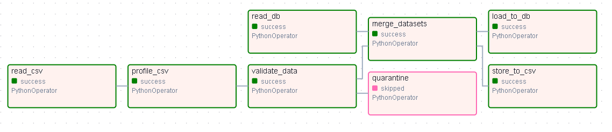

## 1. Descripción del Proyecto
Este repositorio contiene la implementación de un pipeline ETL automatizado utilizando Apache Airflow. El objetivo principal es extraer información de dos fuentes de datos distintas (un archivo CSV de Spotify y una base de datos de Grammys), realizar perfilado, aplicar validaciones de calidad de datos, transformar y cruzar la información, para finalmente cargar los resultados en una base de datos PostgreSQL y exportarlos como un archivo CSV local.



## 2. Estructura del Repositorio
La arquitectura del proyecto sigue las mejores prácticas de separación por capas de datos (RAW, STAGING, PROFILING, GOLD, QUARANTINE).

```text
workshop_02/
├── dags/
│   └── pipeline_workshop.py
├── data/
│   ├── raw/                 # Archivos originales de Kaggle
│   ├── staging/             # Archivos intermedios del procesamiento
│   ├── profiling/           # Reportes generados por ydata-profiling
│   ├── gold/                # Dataset final fusionado
│   └── quarantine/          # Registros que no superan el contrato de datos
├── scripts/
│   ├── init_db.py           # Script para inicializar PostgreSQL
│   └── profile_data.py      # Lógica de generación del reporte de calidad
├── docker-compose.yml       # Configuración del contenedor de PostgreSQL
└── README.md
```
### Justificación de retries
En el orquestador (pipeline_workshop.py), el parámetro retries se estableció en 0. Esto obedece a un principio de diseño estricto: un fallo determinístico de calidad de datos (como un nulo no esperado en el contrato) no debe resolverse mediante reintentos automáticos, sino que debe derivar el lote a cuarentena (trigger_rule="one_failed").

## 3. Validación de Calidad de Datos
Antes de someter los datos de Spotify a validación, se implementó una tarea de perfilado (ydata-profiling) para identificar anomalías.
Basado en esto, se utilizó Pandera para definir el siguiente contrato de datos:
- **track_name** y **artists**: Columnas obligatorias. Se aplicó una estrategia de imputación (fillna("Desconocido")) en la fase de extracción para evitar fallos de completitud que rompan el ETL.

- **popularity**: Restricción de dominio numérico. Se validó que los valores siempre estén en el rango lógico de 0 a 100.

## 4. Lógica de Transformación y Merge
La convergencia de ambas fuentes se manejó bajo las siguientes reglas:

- **Limpieza de llaves (Artists/Workers):** Dado que en Spotify los artistas vienen en listas (separados por ;), se extrajo únicamente el artista principal. Ambos campos se normalizaron a minúsculas y sin espacios.

- **Cruce (Left Join):** Se priorizó el catálogo de Spotify usando un LEFT JOIN hacia los Grammys. Esto permite mantener la base musical intacta, enriqueciéndola con la etiqueta de premio (is_winner) para aquellos artistas que tuvieron coincidencia, imputando con False a los no nominados.

## 5. Reporte estático
Se desarrolló un Data Warehouse (capa GOLD) en PostgreSQL (gold_spotify_grammys). El archivo reporte_final.ipynb se conecta directamente a esta base de datos a través de SQLAlchemy y dotenv para extraer los datos y construir un análisis gráfico (con Seaborn) sobre la firma acústica de los premios y el sesgo de popularidad de la Academia, cumpliendo con la restricción de no leer desde el CSV final.

## 6. Instrucciones de Reproducción (Entorno local/WSL)
**Pre-requisitos:** Asegúrese de tener Docker activo en su sistema y un entorno virtual de Python (recomendado 3.12) creado y activado.

Es importante aclarar que este proyecto debe correrse en **Linux** o en caso de ser windows tener una distro linux en **WSL**, otra alternativa seria utilizar **Codespaces** de GitHub
**Despliegue automatizado (One-Click Deployment):**

6.1. Instalar todas las dependencias del proyecto:
   ```bash
   pip install -r requirements.txt
   ```
   Otorgar permisos de ejecución e iniciar el script maestro. Este script levantará el contenedor de PostgreSQL, inyectará los datos semilla (Grammys) y configurará e iniciará Apache Airflow automáticamente:
    ```bash
    chmod +x scripts/start_airflow.sh
    bash scripts/start_airflow.sh
    ```
    
6.2. Acceder a la interfaz web de Airflow ingresando a http://localhost:8080 (el usuario y la contraseña se imprimirán en las últimas líneas de la terminal).

6.3. En Airflow, encender (unpause) y ejecutar (Trigger) el DAG llamado workshop2_pipeline

6.4. Una vez que todas las tareas del DAG estén en verde oscuro (éxito), abrir el archivo reporte_final.ipynb en VSCode o Jupyter y ejecutar todas las celdas para visualizar el dashboard analítico directamente desde la base de datos.
